# Hosting Projects

There are many options out there for hosting project, both front and back end, so how do you decide where to host your projects.  There are plenty of good choices, and much of it comes down to personal preference.  Let's look at some of these options, as well as some tips and guidelines to follow to make sure you're protected and giving yourself the right add-ons for logging and use.

## Front-End

Publishing a front end site is easy.  There's a slew of options out there for hosting your front-end sites, both free and paid.

### Github Pages

Github pages is the easiest way to host your project, and can be done entirely from their website. Github is easy to use, has good security, and provides SSL by default.

Head to the settings of the project you want to host, and scroll down to the Github Pages section.

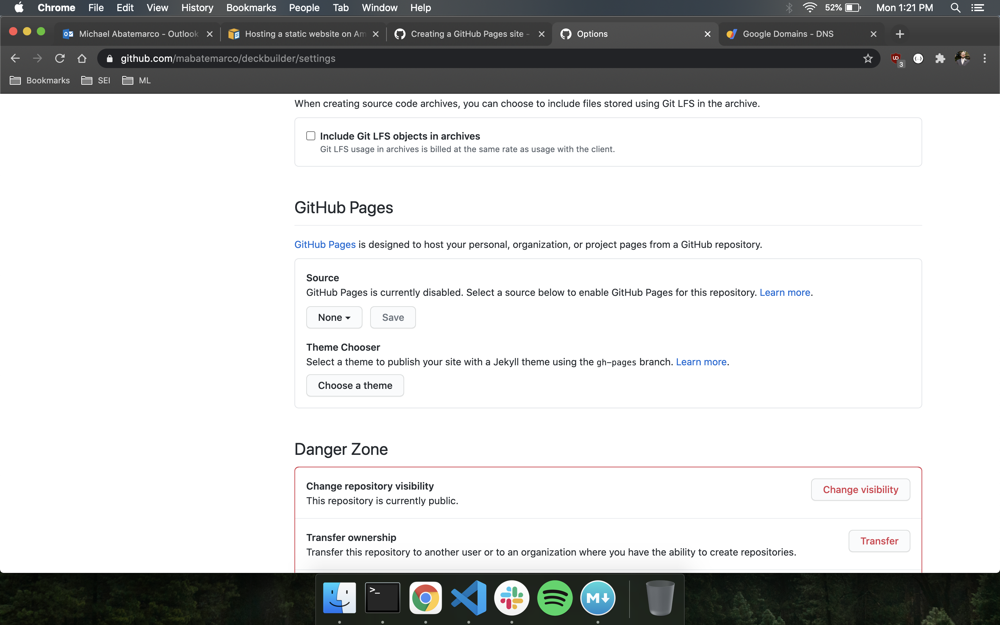

Select the branch you want to upload (likely master), press save, and in a few minutes your site will be published at the address they provide.

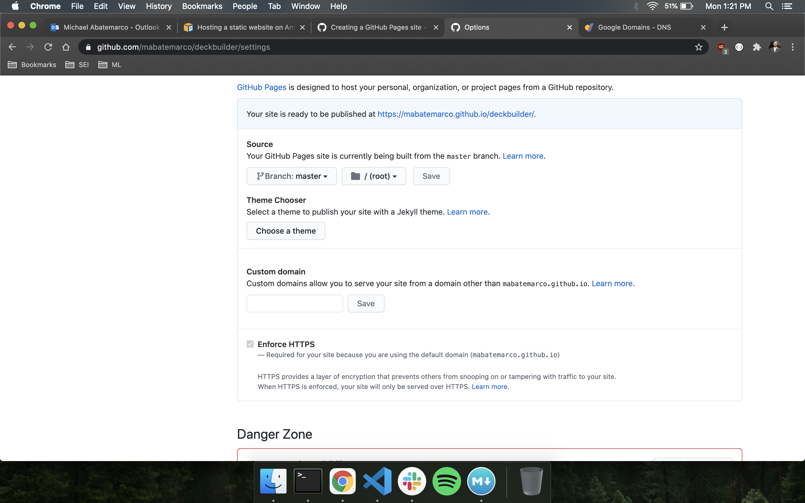

#### Using a custom domain with GitHub pages

We can use this hosted site on a custom domain that we own. We start by setting the custom domain of our GitHub pages site to our custom URL.

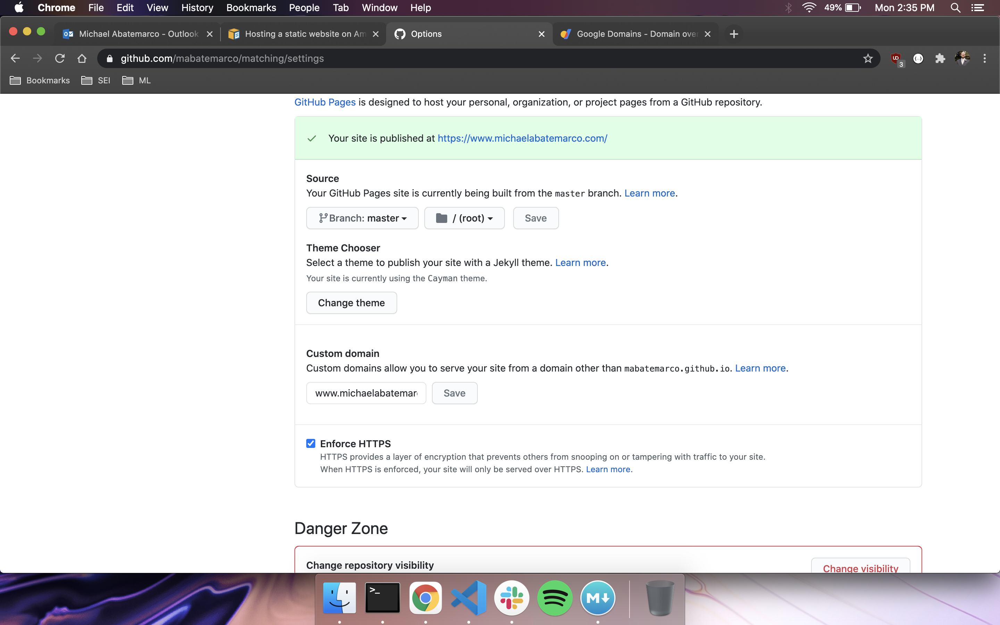

Then we head to our google domain site, and manage our domain.  We want to head to our DNS section.

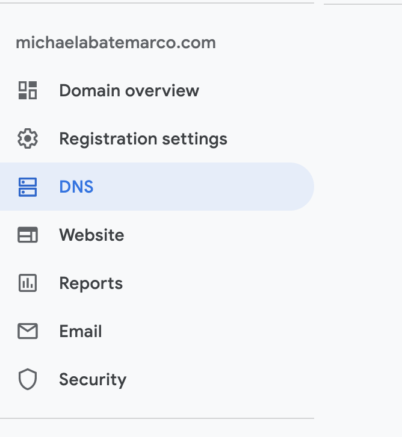

From there, we need to scroll down to our Custom resource records section, and add CNAME files.

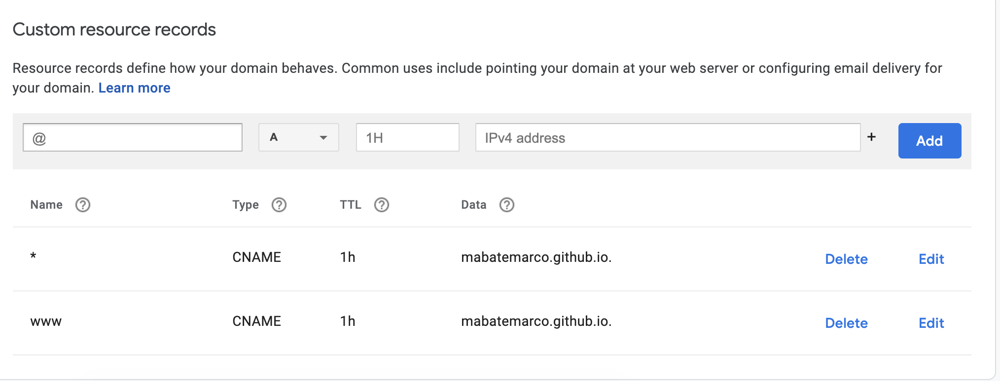

The "Name" section has to do with the subdomain of the URL, which is mostly often 'www'.  We can also add a '*', or wildcard, subdomain to make sure that any subdomain will work.  The "Data" section of the CNAME record must be set to <your GitHub username or organization>.github.io.

### Surge

Surge is another free and easy way to host your projects online.  Like GitHub, it provides free SSL certification, gives you unlimited projects, supports custom domains, and is easy to use.

To start, we need to install surge on our command line.  We need to make sure that we have Node and npm You can do that [here](https://nodejs.org/en/download/package-manager/#macos).  We then run:

	npm install --global surge
	
Now that we have surge on our computer, we can directly upload projects to live sites through our command line.  Navigate to the root directory of the site you want to host, and run

	surge
	
in the command line.

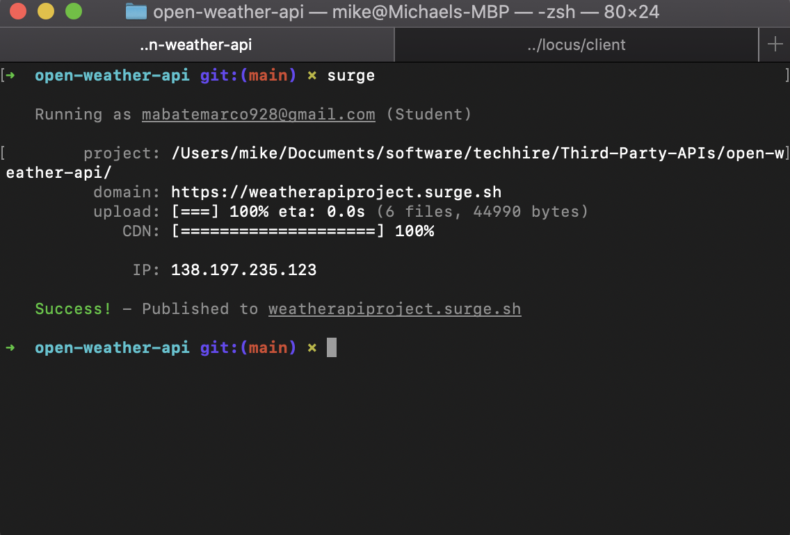

You'll need to create an account if this is the first time you've used surge.  Every time we run surge, we need to confirm the project directory and the domain to deploy to.  If we run the `surge` command from the root directory, the project path will already be correct.

For the domain, surge will create a random URL for you, which you can modify.  You can change the subdomain to whatever you like, but the URL must end with `.surge.sh` (unless we've linked our custom domain to surge).  We can add `https://` to the beginning of our domain to force SSL. Surge will automatically route us to the secure version of the site, even if we try to access the `http` version.

Every time we change our project and want to deploy the changes, we need to go through the process again.  This is fairly fast, but one thing we can do to streamline the process is adding a CNAME file to our project.

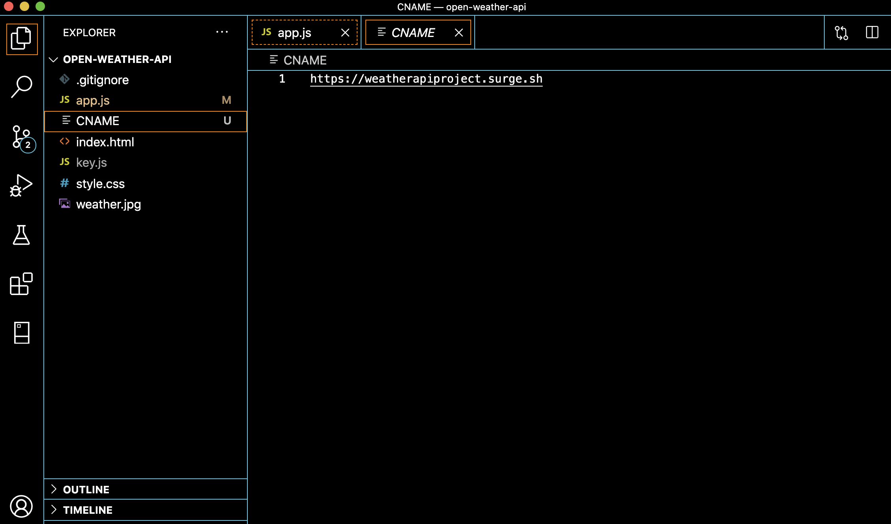

Now our domain will automatically be set to what we specify in our CNAME.

#### Using a custom domain with surge

Deploying our surge site to a custom URL is a similar process to doing so with GitHub pages.  We set custom resource records on our domain provider, just like we did before, though this time we use A records instead of CNAME.  A records point to ip addresses, whereas CNAME records point to URLs.

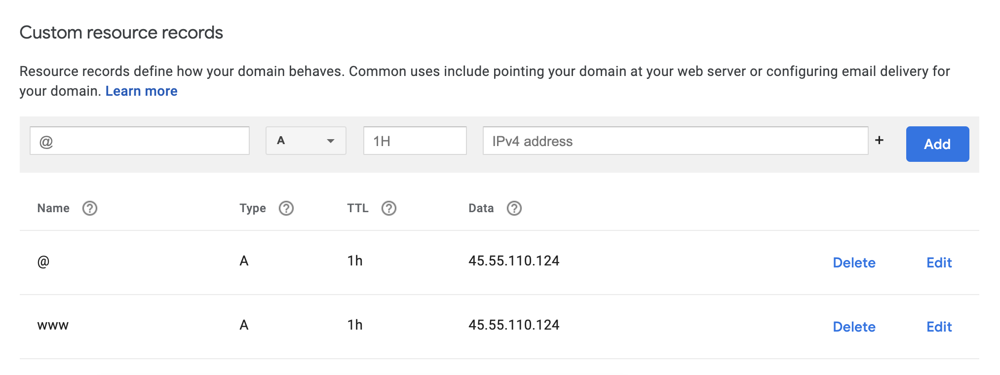

Once that's done, we can now change the CNAME file we created in our project to our custom domain, and deploy right to our custom URL from our command line

#### Uploading React projects to surge

Surge is meant to host static websites, meaning that React's structure will confuse it.  Please note that a static website does not mean that we cannot use api calls or change the page using JS.  We need to create a static build to deploy.

Inside of the React project, we run `npm run deploy`.  This will create a 'build' directory inside of our React folder.  To ensure that we can still use routing inside of our app, we need to rename our 'index.html' file to '200.html'.  Once we've done that, we run surge from the build directory and follow the same steps as above.

These steps can get a little tiresome to do over and over when editing our site, so we can add this to our package.json:

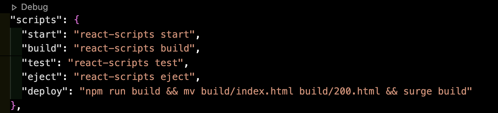

Now we can run `npm run deploy` from our React repo.

### Other Options

These are very few of the many options out there.  Play around with other hosting sites.  Take a look at Vercel for an alternative to surge for free hosting.  For higher-traffic needs, using an S3 buckets configured to host a site through AWS is a great option.

## Back-End

Back-end app hosting gets more complicated than front-end. We need to make sure that we've uploaded both our API and our database, and that they can communicate with each other (and our front-end app).  Because many of our sites can accept and store user data in our back end, we also need to be careful when making changes to our back-end app, as we don't want to corrupt of delete user data.

As with front-end, there are many options for hosting.  Today, we'll be talking about Heroku.

### Heroku

Heroku is an excellent choice for our hosting needs.  It is supported by a slew of add-ons that we can use to customize our projects, and offers both free and paid tiers of service to meet our traffic needs.

#### Setting Up

To install Heroku, we can run 

	brew tap heroku/brew && brew install heroku

or 

	npm install -g heroku

depending on what package manager we use.  After installing, we can run 

	heroku login
	
to create our account and log in on our machines.

#### Creating a Project

Now that we have a heroku account, we can start uploading projects.  The process is different depending on what language we're using, but we can always start with creating a new project on the site.  We can do that from the command line, or we can use the heroku site.

From our dashboard, we can create a new project using the button on the top right.

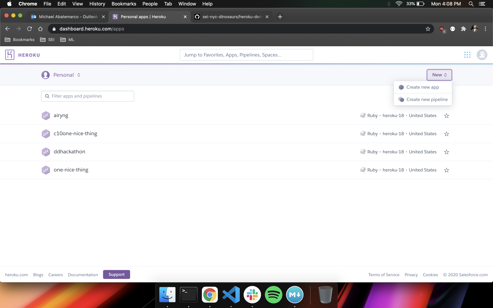

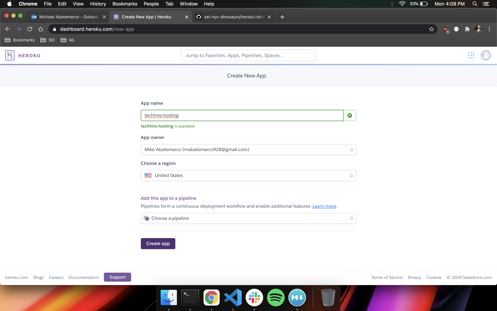

Heroku is deployed to using the same method that we use for git.  Once we've created our project, heroku will give us the code to add the heroku git endpoint we can push to.

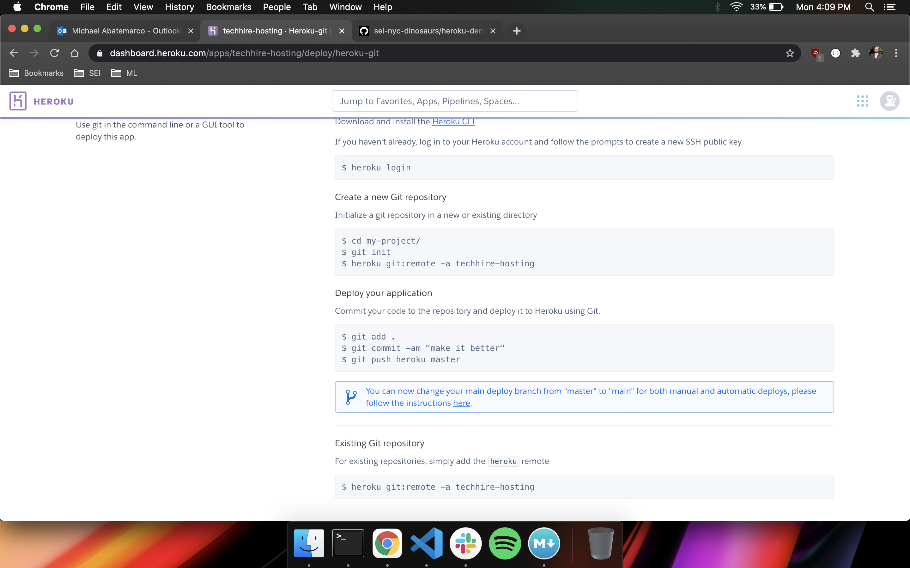

Once we've added heroku to our projects using 
	
	$ heroku git:remote -a techhire-hosting

We can upload our projects to heroku in a similar way that we push them to GitHub, like so:

	git add .
	git commit -m "some comments here"
	git push heroku master
	
Once we've uploaded our projects, we usually need to configure then or initialize our database.  Depending on our language, we need to do different things.  Check out these articles below for information on how to upload different languages to heroku.

[Spring Boot](https://www.callicoder.com/deploy-host-spring-boot-apps-on-heroku/)
[Rails](https://www.codecademy.com/articles/deploy-rails-to-heroku)
[Django](https://www.codementor.io/@jamesezechukwu/how-to-deploy-django-app-on-heroku-dtsee04d4)

#### Add-ons

We also often need add-ons to help run our database.  In the picture below, I've deployed a Rails app that uses PostgreSQL, which requires the Heroku Postgres add-ons.  Usually, Heroku will add the necessary add-ons automatically.  These add-ons are by default free, but usually have improved versions that offer higher capacity databases and higher speeds.

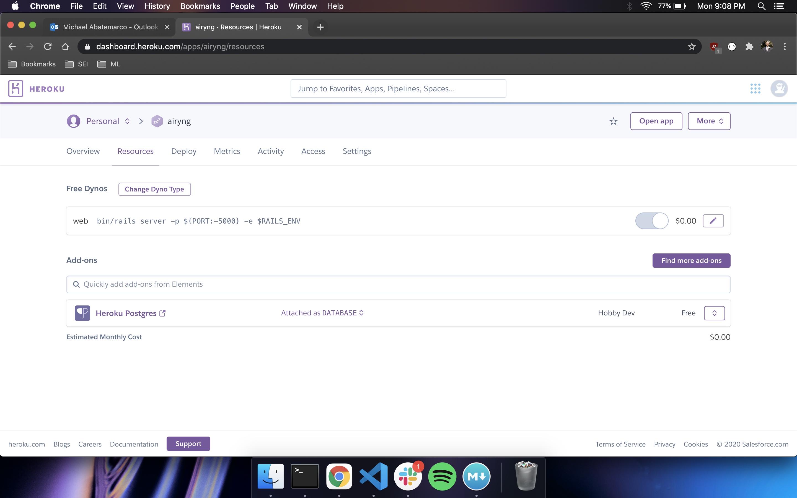

There are some cool add-ons that we can add to help us work in our apps, whether its to get better errors in our logs, to map where people are using our site, or to help with caching, there's a lot out there.  Take a look at some of these helpful add-ons [here](https://www.dnsstuff.com/best-heroku-add-ons).

#### Environmental Variables

It's always a good idea to hide some of our variables.  We can do this by hiding our variables in the environment, and we can add the variables directly into our environment in the settings tab of our heroku app.  Scroll down to our config vars and add as many variables as you need.

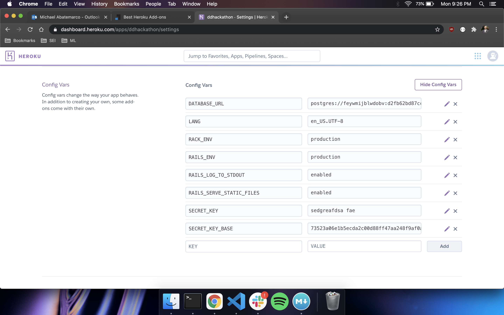

#### Dynos

Dynos are virtualized linux containers that do the work of our app on Heroku.  We can think of dynos as processing power or server space for our apps.  More and/or more powerful dynos can make our apps run faster.  Read up on dyno pricing and capacity [here](https://www.heroku.com/dynos)

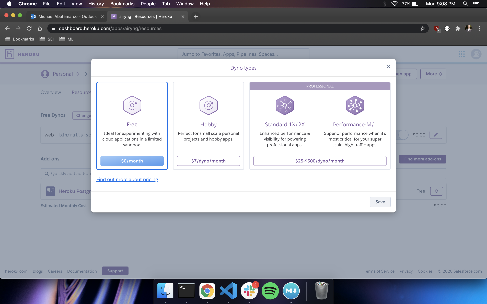

#### Viewing your Database

Once our app is up and running, we often want to be able to directly view and edit our database.  If we click on our database add-on, it will take us to our datastore page, where we can read info on our database.

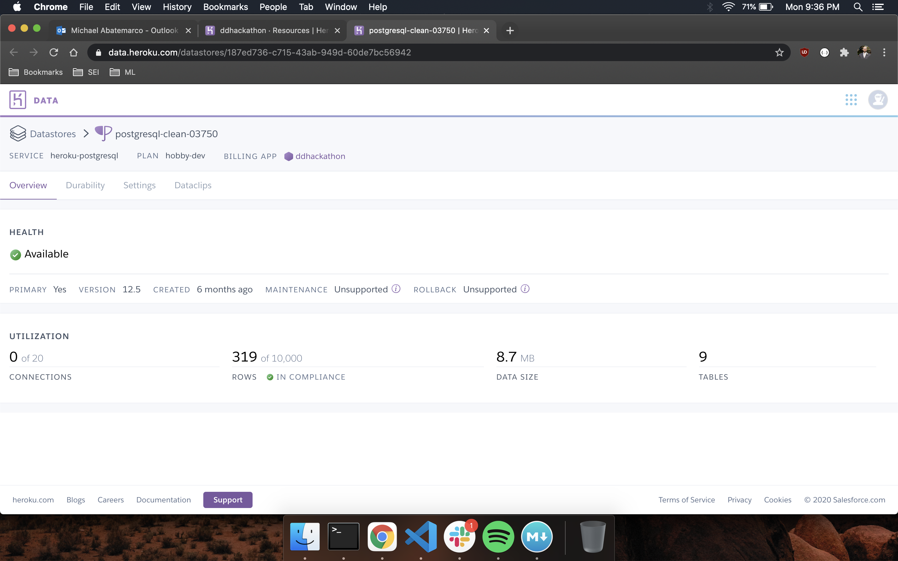

If we go into settings and open our database credentials, we can get some connection information to read our database directly.

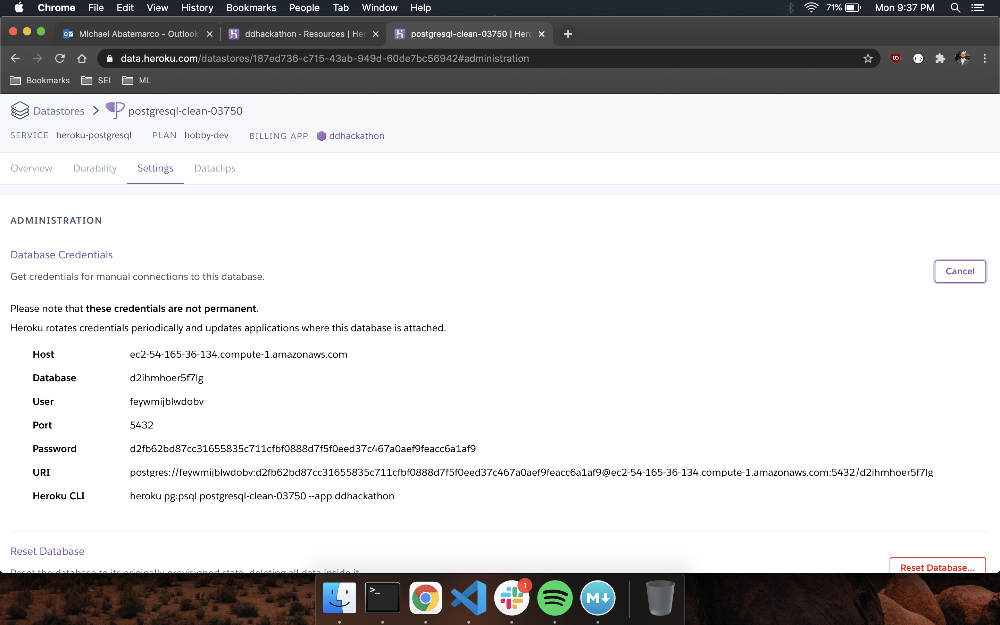

If we enter this information into a database reader like Postico, we can view and edit our database info directly.  Be careful when editing using Postico, as it can override back end protections and break part of your app.

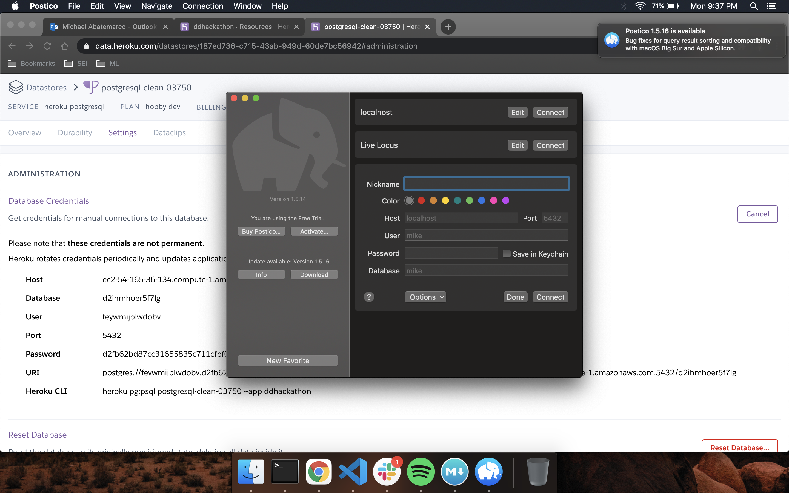
